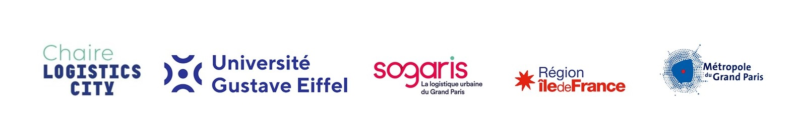

```{r setup, include=FALSE}
knitr::opts_chunk$set(message=FALSE,warning=FALSE, cache=TRUE)
```


::: sidebar-logo

:::

# E-commerce Warehousing in France {.tabset .unnumbered}

## Cartographic Results:

```{r libraries, include=FALSE}
#Loading the needed libraries
library(leaflet)
library(leaflet.extras)
library(leaflet.providers)
library(dplyr)
library(htmltools)
library(htmlwidgets)
library(sf)
library(readr)
library(mapview)
library(DT)
library(readxl)
```

```{r, include=FALSE}
# Loading the data
france <- read.csv2("D:/Master Thesis/DBMS//LVMT_DB/data/WHData/ecommerce/elogistics_companies_sitadel_geolocated1.csv")
manually_collected <- read.csv("D:/Master Thesis/DBMS/LVMT_DB/data/WHData/ecommerce/EcommerceManuallyCollected1.csv", fileEncoding = "Windows-1252")
```

```{r, include=FALSE}

# Loading the data from a geojson file
logisticzonesGR <- suppressMessages(st_read("D:/Master Thesis/DBMS/LVMT_DB/data/WHData/GR/GRlogisticsFR2018-1.geojson"))
logisticzonesGR_sp <- suppressMessages(st_zm(logisticzonesGR))
logisticzonesGR_sp <- as(logisticzonesGR_sp, "Spatial")
```

```{r, include=FALSE}
# Ensure latitude and longitude are numeric
france$latitude <- as.numeric(france$latitude)
france$longitude <- as.numeric(france$longitude)


manually_collected$longitude <- as.numeric(manually_collected$longitude)
manually_collected$latitude <- as.numeric(manually_collected$latitude)

```

```{r, include=FALSE}
# Filtering out rows with NA or invalid latitude/longitude values
france <- france %>% filter(!is.na(latitude) & !is.na(longitude) & latitude >= -90 & latitude <= 90 & longitude >= -180 & longitude <= 180)

manually_collected <- manually_collected %>% filter(!is.na(latitude) & !is.na(longitude) & latitude >= -90 & latitude <= 90 & longitude >= -180 & longitude <= 180)

#Filtering out the warehouses that are lesss than 5000m²

france <- france %>% 
  filter(superficie_terrain >= 5000)
```

```{r, include=FALSE}


# Create a color palette for different categories in destination_principale
destination_palette <- colorFactor(c("blue", "green", "red", "turquoise", "orange", "cyan", "brown", "purple", "black"), france$destination_principale)

# Create a mapping vector for destination_principale
destination_labels <- c(
  "1" = "Residential",
  "2" = "Hotel Accommodation",
  "3" = "Offices",
  "4" = "Commercial",
  "5" = "Craft",
  "6" = "Industrial",
  "7" = "Agricultural",
  "8" = "Warehouse",
  "9" = "Public Service"
)
```

```{r, include=FALSE}

# Creating the Leaflet map
warehouse_map <- leaflet() %>%
  addPolygons(data = logisticzonesGR_sp, group = "GR Logistic Zones",
              color = "gold", weight = 1, smoothFactor = 0.3, fillOpacity = 0.5) %>%
  addProviderTiles("CartoDB.Positron", group = "CARTO") %>%
  addProviderTiles("OpenStreetMap.France", group = "OSM France") %>%
  addProviderTiles("GeoportailFrance.orthos", group = "IGN Ortho") %>%
  addProviderTiles("GeoportailFrance.plan", group = "IGN Plan") %>%
  addProviderTiles("GeoportailFrance.parcels", group = "IGN Parcels") %>%
  addProviderTiles("OpenRailwayMap", group = "Open Railway Map") %>%
  addCircleMarkers(
    data = manually_collected,
    lng = ~longitude,
    lat = ~latitude,
    popup = ~paste0(
      "<strong>Company:</strong> ", company, "<br>",
      "<strong>NAF Code:</strong> ", NAF.code, "<br>",
      "<strong>Area (m²):</strong> ", area, "<br>",
      "<strong>Address:</strong> ", address, "<br>",
      "<strong>Details:</strong> ", details
    ),
    radius = 5,
    fillColor = "maroon",
    fillOpacity = 0.8,
    color = "maroon",
    stroke = FALSE,
    group = "Manually Collected Warehouses"
  )

```

```{r, include=FALSE}
#Setting the view of the map: 
warehouse_map <- warehouse_map %>%
  setView(lng = 2.34, lat = 46.53, zoom = 5)
```

```{r, include=FALSE}

# Adding circle markers for each category in destination_principale
for (category in unique(france$destination_principale)) {
  filtered_data <- france %>% filter(destination_principale == category)
  category_label <- destination_labels[as.character(category)]
  warehouse_map <- warehouse_map %>%
    addCircleMarkers(data = filtered_data, 
                     ~longitude, ~latitude,
                     popup = ~paste0("<strong>Company:</strong> ", denom_dem, "<br>",
                                     "<strong>Size (sq. meter):</strong> ", superficie_terrain, "<br>",
                                     "<strong>Opened:</strong> ", dpc_aut, "<br>",
                                     "<strong>NAF Code:</strong> ", ape_dem, "<br>",
                                     "<strong>SIRET:</strong> ", siret_dem),
                     radius = 4, fillColor = ~destination_palette(category), fillOpacity = 0.8, color = ~destination_palette(category), stroke = FALSE, group = paste("Category:", category_label), layerId = ~denom_dem)
}

```

```{r, include=FALSE}
# Adding a search box, still not working

warehouse_map <- warehouse_map %>%
  addSearchFeatures(
    targetGroups = c("Manually Collected Warehouses", sapply(unique(france$destination_principale), function(x) paste("Category:", destination_labels[as.character(x)]))),
    options = searchFeaturesOptions(zoom = 12, openPopup = TRUE, firstTipSubmit = TRUE, autoCollapse = TRUE, hideMarkerOnCollapse = TRUE)
    )
```

```{r, include=FALSE}

# Adding layers control and other map features
warehouse_map <- warehouse_map %>%
  addLayersControl(baseGroups = c("CARTO", "OSM France", "IGN Ortho", "IGN Plan"),
                   overlayGroups = c("Manually Collected Warehouses", sapply(unique(france$destination_principale), function(x) paste("Category:", destination_labels[as.character(x)])), "IGN Parcels", "Open Railway Map", "GR Logistic Zones"),
                   options = layersControlOptions(collapsed = FALSE)) %>%
  hideGroup(c("IGN Parcels", "Open Railway Map")) %>%
  addScaleBar(position = "bottomleft", options = scaleBarOptions(metric = TRUE, imperial = FALSE))

```

```{r, echo=FALSE}
# Adding a legend to the map
warehouse_map <- warehouse_map %>%
  addLegend(
    position = "bottomleft",
    colors = c("maroon", "gold", c("blue", "green", "red", "turquoise", "orange", "cyan", "brown", "purple", "black")),
    labels = c("Manually Collected Warehouses", "GR Logistic Zones", destination_labels),
    title = "Legend",
    opacity = 0.7
  )

```


# Interactive Map

The following map shows the last two approaches experimented to identify the ecommerce warehouses, the categories of the layers in the map show the what category each of the warehouses are actually classified in SITADEL database,

The approach is based on a list of the logistics companies workng in the E-commerce logistics, the list contained their names, then it was used to filter any establishment with a similar name.

Later the results that have an area less than 5000m² were filtered out, then the last results were matched with SIRENE database to obtain the coordinates of each of those establishments in order to map them.

The results is as the following map shows.

```{r, echo=FALSE}
# Display the map
warehouse_map

```

Of course each approach has its own issues and lacks of an ultimate verification method. This one for example included some locations that are in the middle of nowhere. Also some establishments have the area wrong with enormus numbers. And finally, the filtering process for some reason it didn't result with the actual results that we may get if we did the filtering manually in the database frame, for example Amazon two logistics companies include more than 30 warehouses but not all of them are showing up on the map.

# Interactive Table:

<center>

```{r, echo=FALSE}
excel_data <- read_excel("D:/Master Thesis/DBMS/LVMT_DB/data/WHData/ecommerce/EcommerceManuallyCollected1.xlsx")

# Render the Excel data as an interactive table
datatable(excel_data, options = list(pageLength = 5, autoWidth = TRUE, scrollX = TRUE, fixedHeader = TRUE, dom = 'Bfrtip', buttons = I('colvis'),
    pagingType = 'full_numbers', searching = TRUE))

```

</center>


::: bottom-banner

:::
