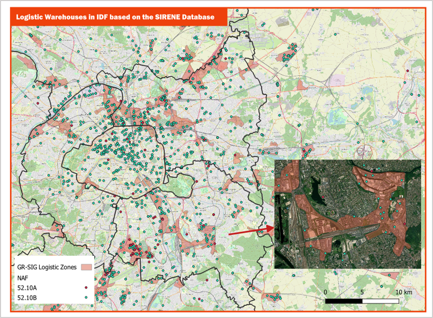
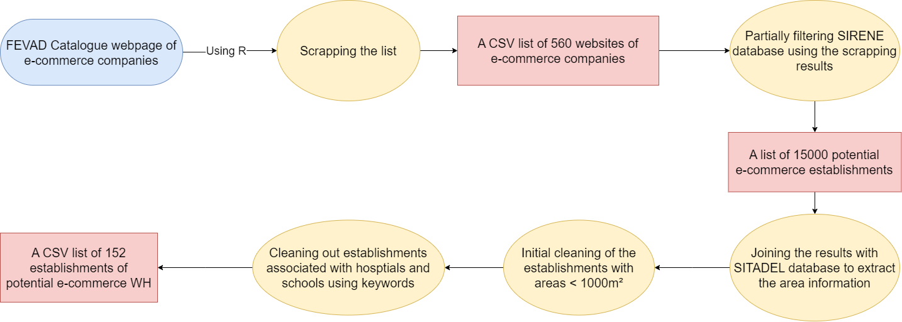
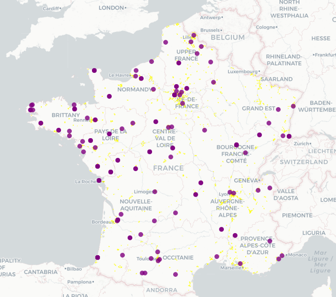
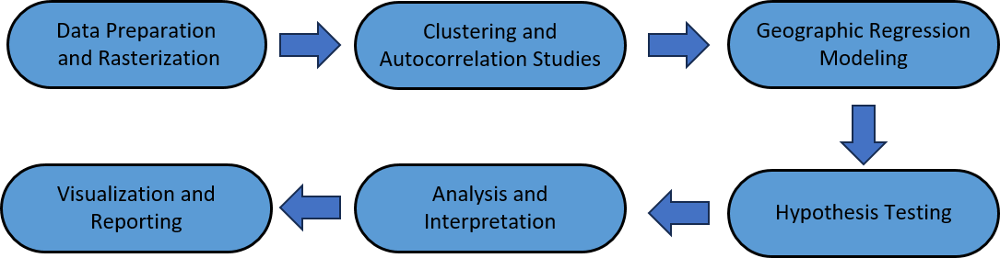

```{r setup, include=FALSE}
knitr::opts_chunk$set(message=FALSE,warning=FALSE, cache=TRUE)
```

::: toc-header

:::

# Analysis

On the analysis of the warehouses location patterns: to show your first report on data collection + what Coriolan did during his internship)

# Warehouses Enumeration Approaches {.tabset}

::: panel-tabset
## NAF Codes

One of the first and basic methods utilized was a direct use of logistics activities-related NAF codes in SIRENE database to locate logistic warehouses, and then, the NAF codes were used as categories to explore potential use of them.

The methodology used was as the following diagram shows:


The results are as shown in the following map:



## FEVAD List

**Methodology:**

This approach is based on FEVAD list of more than 560 companies with e-commerce activities, the following graph shows the details of the approach:



The results are as shown in the following map:



## Manually Collected

This approach represents the most effective method of identifying the e-commerce warehouses, which is manually collecting and verifying the locations based on a list of top e-commerce companies by FEVAD.

The following map shows the results of this process with an overlay layer of the Grand-Région logistic zones for reference.

::: {style="clear: both;"}
:::
:::

\

------------------------------------------------------------------------

# Next Phase




::: bottom-banner

:::
